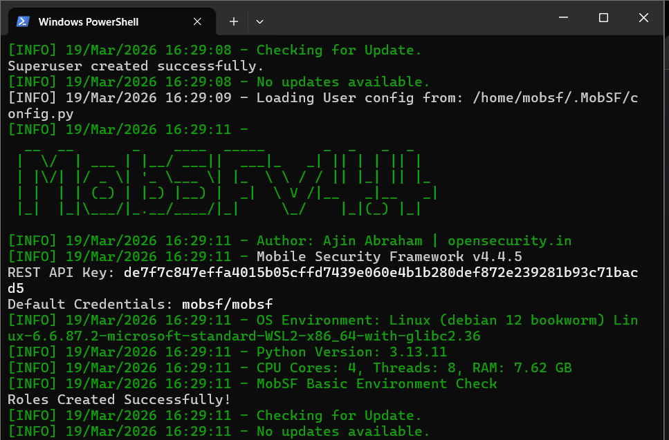
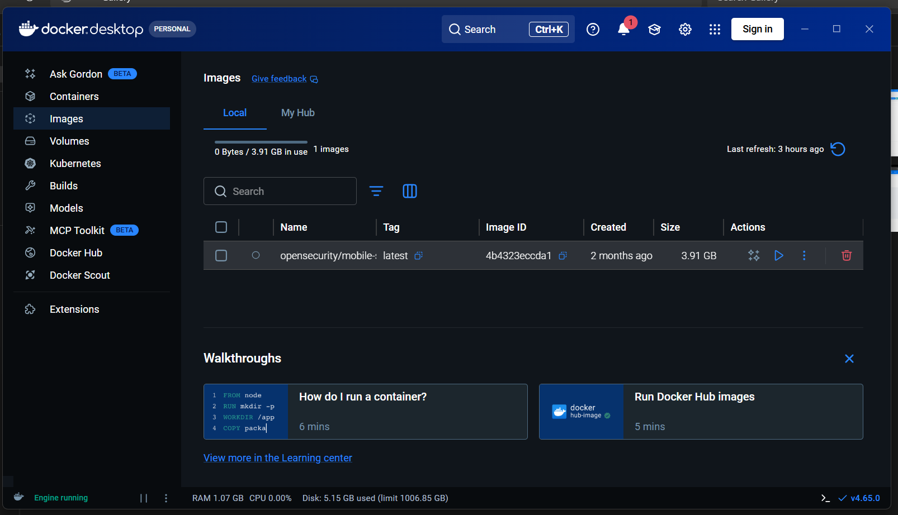
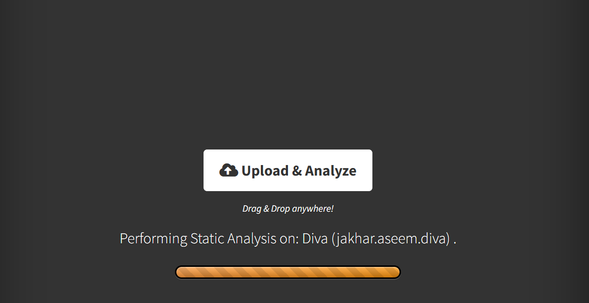
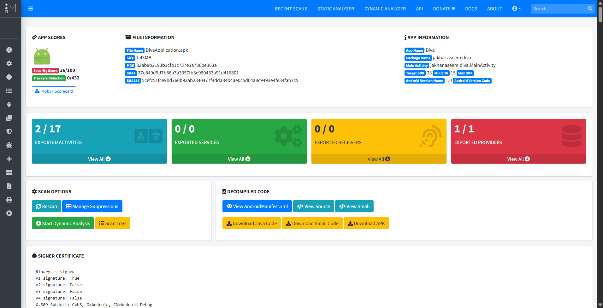
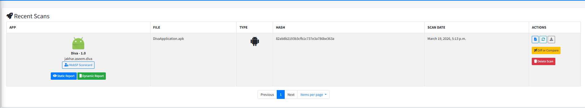
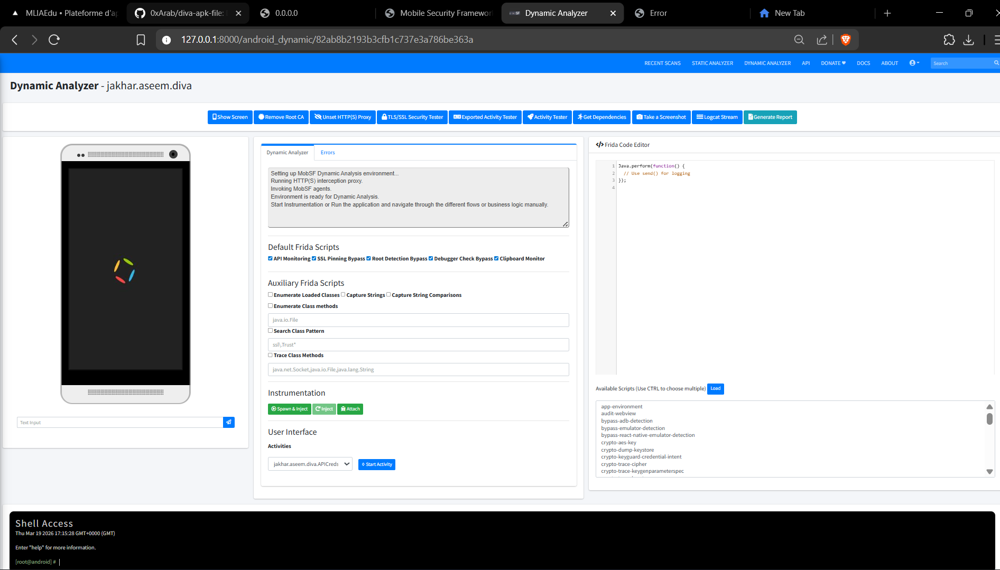
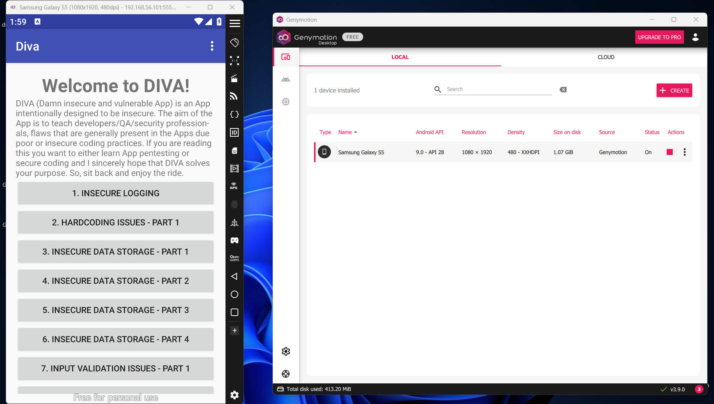
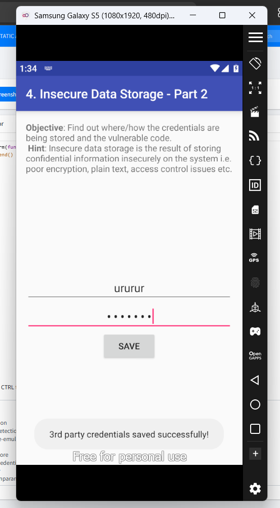
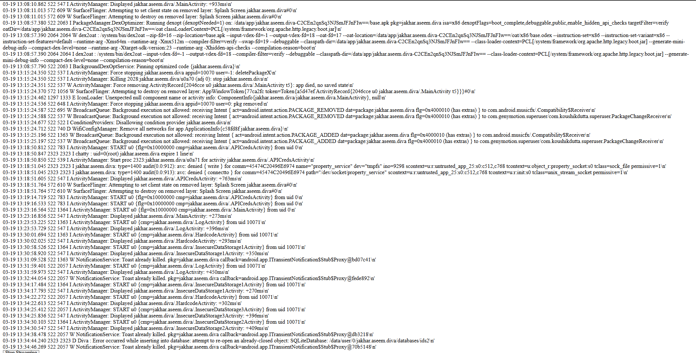
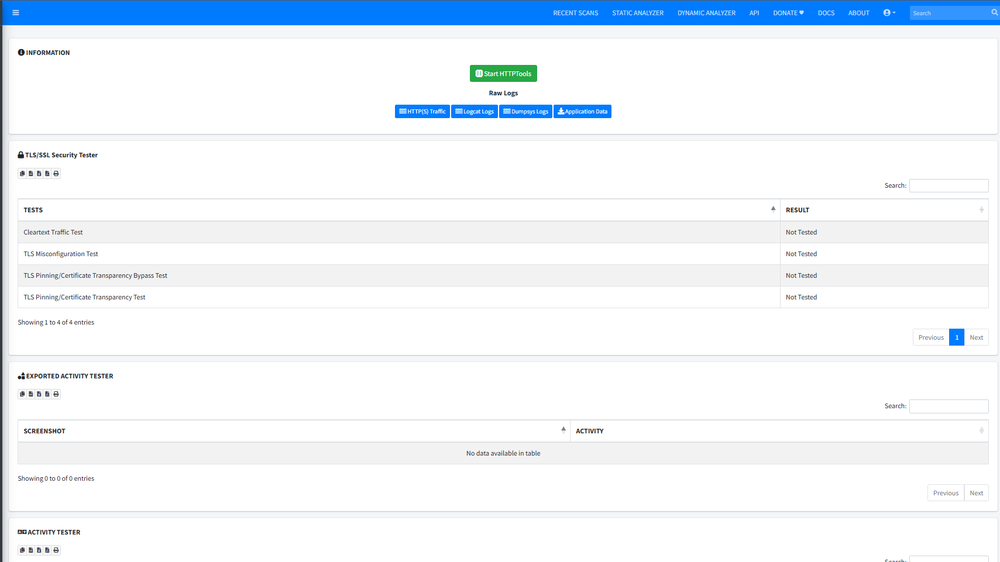

# Lab_7_MobileSecurity
# TP 7 — Analyse de Sécurité des Applications Mobiles avec MobSF et DIVA

**Module :** Sécurité des Systèmes et Réseaux  
**Outil principal :** Mobile Security Framework (MobSF) v4.4.5  
**Application cible :** DIVA (Damn Insecure and Vulnerable App) — `jakhar.aseem.diva`  
**Environnement d'exécution :** Windows 11, Docker Desktop, Genymotion  

---

## 1. Objectif

Ce travail pratique vise à acquérir une maîtrise opérationnelle des techniques d'audit de sécurité des applications Android, en articulant deux axes complémentaires : l'analyse statique du bytecode et du manifeste sans exécution, et l'analyse dynamique par instrumentation en temps réel. L'application DIVA, conçue délibérément pour présenter des failles classiques, constitue le support idéal pour observer et documenter des comportements non sécurisés dans un contexte contrôlé.

---

## 2. Environnement de Travail

| Composant | Version / Détail |
|---|---|
| Système d'exploitation | Windows 11 |
| MobSF | v4.4.5 (conteneur Docker) |
| Docker Desktop | v4.65.0 |
| Image Docker | `opensecurity/mobile-security-framework-mobsf:latest` (3.91 GB) |
| Émulateur Android | Genymotion Desktop v3.9.0 — Samsung Galaxy S5 (API 28) |
| Application analysée | DivaApplication.apk — v1.0 (`jakhar.aseem.diva`) |
| Python (MobSF interne) | 3.13.11 |
| Ressources allouées | 4 cœurs CPU, 8 threads, 7.62 Go RAM |

---

## 3. Mise en Place

### 3.1 Déploiement de MobSF via Docker

MobSF a été déployé sous forme de conteneur Docker afin de bénéficier d'un environnement isolé et reproductible. L'image officielle `opensecurity/mobile-security-framework-mobsf` a été récupérée depuis Docker Hub, puis instanciée via la commande :

```
docker run -it -p 8000:8000 opensecurity/mobile-security-framework-mobsf:latest
```

Au démarrage, le framework initialise ses bases de données, charge sa configuration Python et génère une clé d'API REST unique. L'interface web devient accessible à l'adresse `http://127.0.0.1:8000` avec les identifiants par défaut `mobsf/mobsf`.



### 3.2 Image Docker dans Docker Desktop

L'interface graphique de Docker Desktop confirme la présence de l'image MobSF en local (3.91 Go), construite il y a deux mois et étiquetée `latest`. L'état du moteur Docker est affiché comme actif.



### 3.3 Configuration de l'émulateur Android

Des tentatives initiales de démarrage d'un périphérique virtuel via Android Studio (AVD) ont échoué, notamment en raison de problèmes de compatibilité avec l'accélération matérielle HAXM (`avdmanager`/`emulator` non fonctionnels dans le contexte système). La décision a été prise de basculer vers **Genymotion Desktop**, qui offre une intégration plus stable avec MobSF. Un émulateur Samsung Galaxy S5 (Android 9.0, API 28, résolution 1080×1920, 480 dpi) a été configuré et mis en service.

---

## 4. Analyse Statique

### 4.1 Soumission du fichier APK

L'application DIVA a été importée dans MobSF via le mécanisme de glisser-déposer ou en cliquant sur le bouton *Upload & Analyze*. Dès la réception du fichier, le framework enclenche automatiquement la chaîne d'analyse statique : décompilation du bytecode Dalvik, extraction du manifeste Android et génération des empreintes cryptographiques.



### 4.2 Résultats du rapport statique

Le rapport statique généré par MobSF révèle les informations suivantes :

**Identifiants du paquet :**
- Nom du fichier : `DivaApplication.apk` (1.43 Mo)
- Package : `jakhar.aseem.diva`
- Activité principale : `jakhar.aseem.diva.MainActivity`
- Target SDK : 23 / Min SDK : 15

**Score de sécurité : 36 / 100** — ce résultat particulièrement bas traduit la présence de multiples déficiences structurelles dans le code source.

**Trackers détectés : 0 / 432** — aucun traceur publicitaire ou analytique n'est identifié, ce qui s'explique par la nature pédagogique de l'application.

**Composants exportés :**
- 2 / 17 activités exportées
- 0 service exporté
- 0 récepteur de diffusion exporté
- 1 / 1 fournisseur de contenu exporté

L'exposition d'un `ContentProvider` sans contrôle d'accès constitue un vecteur d'exploitation potentiel permettant à toute application tierce de lire ou manipuler les données stockées.

Le certificat de signature est de type debug (`v1` uniquement), ce qui atteste qu'aucune procédure de signature de production n'a été appliquée.



### 4.3 Historique des analyses

La section *Recent Scans* de MobSF consigne l'ensemble des analyses effectuées, avec leurs métadonnées asociées (nom du fichier, empreinte MD5, date et heure d'exécution). Cette vue confirme l'exécution complète du scan pour le fichier `DivaApplication.apk` le 19 mars 2026 à 17h13.



---

## 5. Analyse Dynamique

### 5.1 Mise en route de l'environnement dynamique

L'analyse dynamique requiert qu'un périphérique Android soit connecté ou qu'un émulateur soit actif et détecté par MobSF. Une fois Genymotion lancé avec le Samsung Galaxy S5, MobSF injecte automatiquement ses agents (proxy HTTP(S), scripts Frida) dans l'émulateur. Le terminal PowerShell affiche la séquence d'initialisation de la base de données Django et la confirmation de l'environnement prêt pour l'instrumentation.



### 5.2 Interface de l'analyseur dynamique

Le Dynamic Analyzer de MobSF expose un tableau de bord complet permettant d'orchestrer les tests en temps réel. Les fonctionnalités disponibles incluent notamment :

- Scripts Frida préconfigurés : contournement SSL Pinning, détection root, surveillance du presse-papiers, monitoring des API
- Points d'injection Frida personnalisables via un éditeur de code intégré
- Contrôle des activités : lancement manuel de composants via le menu déroulant
- Accès shell root à l'émulateur depuis l'interface web

L'environnement indique explicitement : *"Environment is ready for Dynamic Analysis"*.


### 5.3 Application DIVA en cours d'exécution

L'application DIVA s'affiche dans l'émulateur Genymotion. L'écran d'accueil présente l'ensemble des modules de vulnérabilités disponibles : journalisation non sécurisée, problèmes de codage en dur, stockage de données non sécurisé (4 variantes), validation d'entrée, etc. La fenêtre Genymotion confirme l'utilisation du périphérique Samsung Galaxy S5 via l'adresse IP `192.168.56.101`.



---

## 6. Observations de Sécurité

### 6.1 Stockage non sécurisé des données (Insecure Data Storage — Part 2)

Le module *Insecure Data Storage Part 2* illustre la pratique dangereuse consistant à persister des identifiants sensibles sans chiffrement. Lors du test, des informations de connexion fictives (identifiant `ururur`, mot de passe arbitraire) ont été saisies puis enregistrées via le bouton *SAVE*. Le message *"3rd party credentials saved successfully!"* confirme que les données ont été écrites sur le système de fichiers sans aucun mécanisme de protection.

Cette faille correspond à la catégorie **M2 – Insecure Data Storage** du référentiel OWASP Mobile Top 10. En pratique, les données sont stockées en clair dans un fichier de préférences partagées ou une base de données SQLite accessible sans droits particuliers sur un appareil rooté.



### 6.2 Traces Logcat exploitables

L'affichage des journaux Android (Logcat) pendant l'exécution de DIVA révèle un volume important d'informations systèmes : démarrage et arrêt des activités (`ActivityManager`), transitions entre composants, erreurs SQLite (`attempt to re-open an already-closed object`), et tentatives de requêtes réseau bloquées par SELinux (`avc: denied`).

Ces traces constituent une surface d'information exploitable par un attaquant ayant accès au périphérique, car elles permettent de reconstituer le flux d'exécution, d'identifier les composants actifs et de détecter des erreurs de traitement potentiellement révélatrices.



### 6.3 Tests TLS/SSL et activités exportées

Le module *TLS/SSL Security Tester* de MobSF soumet l'application à quatre vérifications relatives à la sécurité des communications réseau : trafic en clair, erreurs de configuration TLS, contournement du Certificate Transparency et validation du TLS Pinning. L'ensemble des tests affiche le statut *Not Tested*, ce qui indique que DIVA ne procède à aucune communication réseau chiffrée dans les scénarios testés — cohérent avec son architecture centrée sur les défauts locaux.

Le tableau *Exported Activity Tester* ne recense aucune activité exportée testable dynamiquement, bien que l'analyse statique en ait identifié deux.



---

## 7. Conclusion

L'audit conduit sur DIVA via MobSF met en évidence, de manière concrète et mesurable, les conséquences d'une conception applicative négligente en matière de sécurité. Le score statique de 36/100 n'est pas simplement un indicateur chiffré : il reflète des choix architecturaux problématiques — composants exposés sans restriction, absence de chiffrement des données persistées, verbosité excessive des journaux — qui se traduisent par des vecteurs d'attaque réels lors de l'analyse dynamique.

La transition depuis Android Studio vers Genymotion a démontré l'importance de la flexibilité dans le choix des outils d'émulation, notamment lorsque les contraintes matérielles ou logicielles du poste de travail compromettent la stabilité de l'environnement. MobSF, déployé via Docker, s'est révélé un choix robuste, offrant un pipeline d'analyse unifié allant de la décompilation statique à l'instrumentation Frida en temps réel.

Les vulnérabilités observées — stockage en clair, fuite d'informations par les logs, ContentProvider non protégé — appartiennent aux catégories les plus fréquemment recensées dans les audits d'applications Android en production, ce qui souligne la pertinence pédagogique de DIVA comme support d'apprentissage.

---

*Rapport généré le 19 mars 2026 — Mobile Security Framework v4.4.5*
